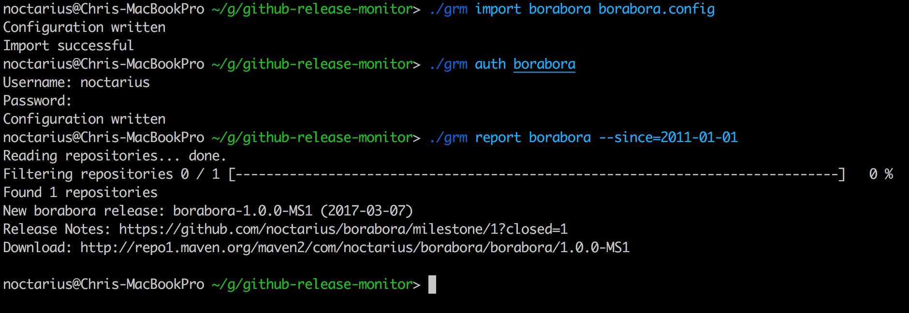

# github-release-monitor

The Github Release Monitor (GRM) is a tool to automatically collect information
about new releases, spread over multiple different repositories.

It is mainly developed to incorporate those release notifications into newsletters
or other types of publication. Typical information included into the release notification
is a download url and the milestone link on Github for that specific release.

To achieve that GRM scans defined remote user accounts for repositories and retrieves
information about releases on those. Depending on the access of the user account used
to scan for repositories, public and private repositories might be available for scanning.

GRM uses a Git alike command structure and is fully embeddable into scripts.

## Table of Contents

 - [Sample Output](#sample-output)
 - [Quick Start](#quick-start)
 - [Usage](#usage)
 - [Commands](#commands)
   - [Command: report](#command-report)
   - [Command: auth](#command-auth)
   - [Command: remote](#command-remote)
   - [Command: config](#command-config)
   - [Command: export](#command-export)
   - [Command: import](#command-import)
 - [Remote Account Definition](#remote-account-definition)
 - [Repository Specific Overrides](#repository-specific-overrides)
 - [Credentials Security](#credentials-security)
 - [Build It Yourself](#build-it-yourself)

## Sample Output

```
New test-sample release: v1.1.0 (2018-05-29)
Release Notes: https://github.com/example/test-sample/milestone/2?closed=1
Download: http://repo1.maven.org/maven2/com/example/test-sample/1.1.0

New test-sample release: v1.0.0 (2018-05-17)
Release Notes: https://github.com/example/test-sample/milestone/1?closed=1
Download: http://repo1.maven.org/maven2/com/example/test-sample/1.0.0
```

## Quick Start

The fastest way to get started with GRM is using an existing, previously exported, configuration
which needs to be imported locally.

After downloading the current GRM release, put the exported configuration file into the same
directory. On the shell only execute the simple command:

```
./grm import <definition-name> <import-file>
```

Obviously _<definition-name>_ and _<import-file>_ have to be replaced with the real values.
The definition name will be the name of the imported configuration. Multiple configuration
can exist at the same time with distinct definition names.

After the configuration was successfully imported, we need to put in our Github user account
credentials to make GRM able to automatically retrieve the repository and release information.
For security concerns please see [Credentials Security](#credentials-security). 

To authenticate the current computer for using a Github user account we execute the following
command:

```
./grm auth <definition-name>
```

GRM will go ahead and ask for the username and password and stores them into the same 
_<definition-name>_ configuration.

Those two steps are only required once. After the configuration is set up, only the report command
is necessary (except for rare cases).

```
./grm report <definition-name> --since=<date>
```

The _<definition-name>_ is the name used during import and authentication. The _<date>_ however 
will most likely change on every use. The date defined is the earliest day to show found releases.

If we pass _2018-03-01_ to the _since_ parameter, only releases on March 3rd 2018 or later will
be shown as a result of the command. 



## Usage

GRM uses a Git alike command structure. That means, there are commands, sub-commands, arguments
and optional parameters.

Every command and sub-command offers context sensitive help to see available further options and
to understand the use for arguments and parameters.

### Commands

GRM offers 6 base commands:

| Command | Description |
| --- | :--- |
| report | The [report](#command-report) command generates the actual release notifications by scanning the remote account and repositories. |
| auth   | The [auth](#command-auth) command retrieves and stores authentication information for a specific remote account. At the moment only username and password authentication is supported. |
| remote | The [remote](#command-remote) command handles adding and removing of remote account definitions. It does not handle authentication like the _auth_ command. |
| config | The [config](#command-config) command can change configuration properties and can be used to put repository specific overrides for default properties. |
| export | The [export](#command-export) command can export a specific remote account definition, including all properties, except for authentication information. |
| import | The [import](#command-import) command can import a previously exported remote account definition, including all properties. | 

Except for the _report_ command, most other commands are only to be used in very specific situations.
  
#### Command: report

The _report_ command is used to actually run GRM against Github and retrieve all repositories of
a specific user and analyze their recent releases.

To use the _report_ command, at least one remote account definition must be configured and authenticated, see [Remote Account Definition](#remote-account-definition).

```
grm report <definition-name>
    [ --since=<since-date> ]
    [ -p=<private_repos> ]
    [ --repository-pattern=<repository-pattern> ]
```

| Argument | Required | Description |
| --- | :--- | :--- |
| definition-name | true | The name of the remote definition |

| Parameters | Required | Description |
| --- | :--- | :--- |
| --since | false | Date of search begin in ISO format YYYY-MM-DD |
| -p, --private | false | Analyze private repositories, default: false |
| --repository-pattern | false | A pattern to match repository names |


#### Command: auth

Configures authorization credentials for remote Github users

```
grm auth <definition-name>
    [ -u=<username> ]
    [ -p=<password> ]
    [ --yes ] 
```

| Argument | Required | Description |
| --- | :--- | :--- |
| definition-name | true | The name of the remote definition |

| Parameters | Required | Description |
| --- | :--- | :--- |
| -u, --username | false | The username to access Github |
| -p, --password | false | The password to access Github |
| --yes* | false | Accept all questions, default: false |


#### Command: remote

##### Remote Add

Adds a remote Github user

```
grm remote add <definition-name> <github-user>
    [ -p=<private> ]
    [ --release-pattern=<release-pattern> ]
    [ --repository-pattern=<repository-pattern> ]
    [ --milestone-pattern=<milestone-pattern> ]
    [ --download-url=<download-url> ]
```

| Argument | Required | Description |
| --- | :--- | :--- |
| definition-name | true | The name of the remote definition |
| github-user | true | The remote user to be registered |

| Parameters | Required | Description |
| --- | :--- | :--- |
| -p, --private | false | Will analyze private repositories, default: false |
| --release-pattern | false | The default pattern to match tag names |
| --repository-pattern | false | The default pattern to match repository names |
| --milestone-pattern | false | The default pattern to match milestone names |
| --download-url | false | The default download url pattern |

##### Remote Remove

Removes a remote Github user

```
grm remote remove <definition-name>
    [ --yes ]
```

| Argument | Required | Description |
| --- | :--- | :--- |
| definition-name | true | The name of the remote definition |

| Parameters | Required | Description |
| --- | :--- | :--- |
| --yes* | false | Accept all questions, default: false |

#### Command: config

##### Config List

Lists all configuration parameters

```
grm config list <definition-name>
```

| Argument | Required | Description |
| --- | :--- | :--- |
| definition-name | true | The name of the remote definition |

##### Config Get

Gets a configuration parameter

```
grm config get <definition-name> <property>
```

| Argument | Required | Description |
| --- | :--- | :--- |
| definition-name | true | The name of the remote definition |
| property | true | The property key to configure |


##### Config Set

Sets a configuration parameter

```
grm config set <definition-name> <property> <value>
    [ --repository=<repository> ]
```

| Argument | Required | Description |
| --- | :--- | :--- |
| definition-name | true | The name of the remote definition |
| property | true | The property key to configure |
| value | true | The property's new value |

| Parameters | Required | Description |
| --- | :--- | :--- |
| --repository | false | Set as repository specific override |

##### Config Remove

Removes a configuration parameter

```
grm config remove <definition-name> <property>
    [ --repository=<repository> ]
```

| Argument | Required | Description |
| --- | :--- | :--- |
| definition-name | true | The name of the remote definition |
| property | true | The property key to configure |
| value | true | The property's new value |

| Parameters | Required | Description |
| --- | :--- | :--- |
| --repository | false | Set as repository specific override |

#### Command: export

Exports configuration properties for remote Github users

```
grm export <definition-name>
    [ --out=<outfile> ]
```

| Argument | Required | Description |
| --- | :--- | :--- |
| definition-name | true | The name of the remote definition |

| Parameters | Required | Description |
| --- | :--- | :--- |
| --out | false | The export path and filename, default: {NAME}.config |

#### Command: import

Imports configuration properties for remote Github users

```
grm export <definition-name> <import-file>
    [ --yes ]
```

| Argument | Required | Description |
| --- | :--- | :--- |
| definition-name | true | The name of the remote definition |
| import-file | true | The path and filename of the config to import |

| Parameters | Required | Description |
| --- | :--- | :--- |
| --yes* | false | Accept all questions, default: false |


### Remote Account Definition

### Repository Specific Overrides

### Credentials Security

GRM uses user account credentials (username and password) of Github account to authenticate itself
against the Github API. This is mainly used to have higher request quotas, before the rate limits
kick in.

The [auth](#command-auth) command therefore asks for username and password and stores those
information with the rest of the [Remote Account Definition](#remote-account-definition) in a local
only configuration file. The default location of this configuration file is under the user's home
directory: *$HOME/github-release-monitor/config* 

The file format uses a Git alike INI version with named sections and key-value pairs.

The password will be encrypted with a system specific key (generated from the computer's
network adapters) and a randomly generated salt.

Credentials are not exported and the stored information can only be used on the computer being
authenticated. If the network adapter configuration changes or a new computer is used and all 
data is transferred, a re-authentication step will be required.

## Build It Yourself

GRM needs Go 1.8+ for compilation.

The repository includes a simple build-script to kick off the compilation process for the current
operating system and CPU platform. To execute a cross-compilation please change the build.sh script
accordingly.

All dependencies are vendored using the vendoring tool [gvt](https://github.com/FiloSottile/gvt).
